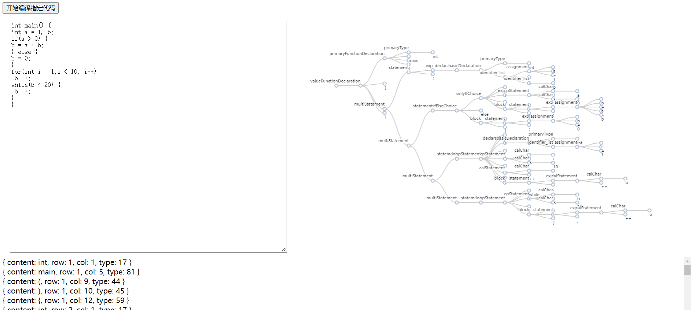
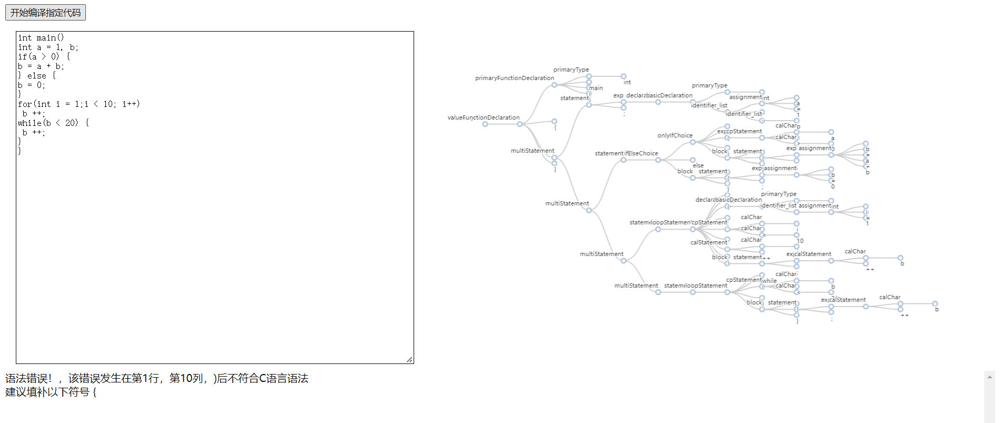

# 1.项目运行结果展示



# 2.项目运行说明
### 2.1 准备nodejs环境
>教程参考：https://blog.csdn.net/Small_Yogurt/article/details/104968169

### 2.2 测试npm
>在命令行查看 ```npm -v``` 是否能显示版本号。nodejs安装时往往会携带npm。npm是一个类似于python中的pip，java中的maven的包管理工具。

### 2.3 安装依赖
>git项目上传不会上传所有依赖，需要本地重新安装依赖。依赖的信息在package.json中描述。在当前文件夹下，即compiler_work文件夹下进入命令行，执行 ```npm install``` 即可。

### 2.4 运行项目
>在安装依赖完毕后运行项目，在刚刚的命令行下继续输入 ```node server.js``` 即可运行本项目。运行后再浏览器中输入http://localhost:3000/show.html 查看是否有页面显示，如果有页面显示，说明项目运行成功

# 3.项目结构说明
### 3.1 外层文件说明
>* echarts.js 一个流行的客户端JavaScript绘图库，这里直接全部引入，避免使用npm安转，cdn引入可能存在版本问题。该库用于绘制语法分析器结果语法树。
> 
> 
>* main.js 词法分析器和语法分析器总控制程序，输入一个源文件，输出词法分析和语法分析后的tokens集合语法树
>
> 
>* server.js 原生的nodejs http服务器程序，在本地监听3000端口，为项目在web端进行演示提供支持
>
> 
>* show.html 项目源代码输入和输出结果演示
> 
>* package.json nodejs项目的依赖表文件，主要是用于记录使用npm包管理工具安装了哪些依赖，也可以提供脚本映射
>
>
>* .idea文件夹 使用jetbrains系列开发环境打开本项目会生成该文件夹

### 3.2 内层文件说明
>* 词法分析器文件夹 负责词法分析模块，文件夹中有对应的readme说明
>
>
>* 语法分析器文件夹 负责语法分析模块，文件夹中有对应的readme说明