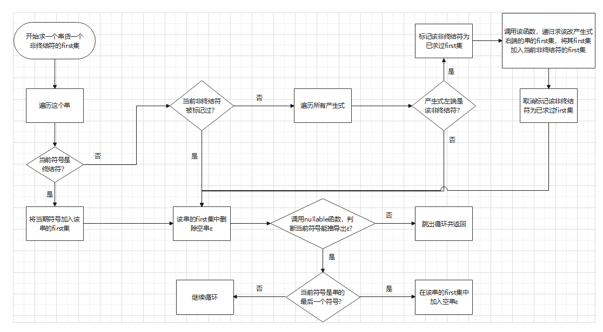
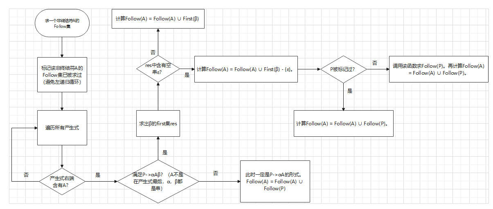
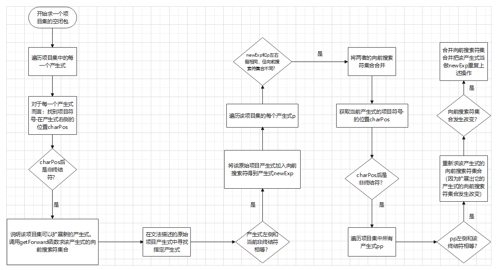

# 1.语法分析器项目结构说明：
### 1.1 信息文件夹
> 该文件夹下存储readme中对算法描述的图片以及算法流程图的原始绘图文件

### 1.2 工具文件夹
> 该文件夹下主要提供工具算法
>* CG.js用于描述C语言文法。
> 
> 
>* changeToken.js用于将词法分析的token集从适合阅读的形式转换为适合语法分析的形式
>
> 
>* deepClone.js用于对象深拷贝。在每次编译时都会对CG.js中提供的C语言文法进行LR1分析，进行扩展。为了保护CG.js中提供的文法对象不被改变，使用深拷贝函数。详情参考我的博客：https://blog.csdn.net/qq_37464878/article/details/122117150?spm=1001.2014.3001.5501
>
> 
>* getFirst.js用于提供计算一个串的first集的算法，详细流程图会在下方介绍
>
> 
>* getFollow.js用于提供计算一个Follow集的算法
>
> 
>* getItem.js用于提供计算一个文法的扩展文法并产生项目产生式的算法
>
> 
>* getTable.js用于提供计算action表和goto表的算法，其中涉及到对上述功能模块的调用，以及求闭包算法，求go函数算法

### 1.3 数据结构文件夹
> 该文件夹下主要提供LR1语法分析使用的数据结构
>* DFA.js提供了LR1分析中产生的项目集DFA的邻接表类，虽然最终结果没有体现，但是中间步骤也生成了该DFA的邻接表用于最初正确性测试
>
> 
>* G.js提供了文法类，提供了文法声明的规范
>
> 
>* SyntaxTree.js提供了语法树节点类，提供了最后结果输出的语法树的节点规范

### 1.4 测试文件夹
> 该文件夹下主要提供测试语法分析时的代码，中间结果与测试数据
>* action.txt是语法分析中间结果action表的输出文件
>
> 
>* goto.txt是语法分析中间结果goto表的输出文件
>
> 
>* procedure.txt是语法分析过程中状态栈，符号栈，输入串等的变化表的输出文件
>
> 
>* 测试数据.txt是一段适合本分析器的c语言代码，是最终词法语法联合测试时使用
>
> 
>* 测试数据2.txt是一段适合本分析器的c语言代码，是最终词法语法联合测试时使用
>
> 
>* 检查错误示例.txt是专门用于测试“智能错误处理程序”的代码示例。检查编译器遇到错误时是否能自动修复并继续运行。
>
> 
>* write.js是负责将语法分析中间结果写入到上述文件中
> 
> 
>* GData.js是提供课本上的文法数据，用于最初的语法分析器独立测试

### 1.5 analysis.js
> analysis.js是语法分析器总控制模块，用于协调上述模块，并给外界main模块提供语法分析器接口

# 2.主要算法描述
### 2.1 first集的计算说明（./工具/getFirst.js）

> 该计算方法考虑并解决了计算过程中可能遇到的循环左递归。
>
> 其中nullable函数是负责计算一个串是否能经过多步推导出空串。逻辑与first集的计算类似，不画流程图了，直接参考代码即可。

### 2.2 follow集的计算说明（./工具/getFollow.js）

> 该计算方法考虑并解决了计算过程中可能遇到的循环左递归

### 2.3 closure闭包计算说明（./工具/getTable.js）
> 与课本本身描述有所不同，在课本算法基础上考虑了其它细节

### 2.4 go函数计算（./工具/getTable.js）
> go函数的实现与描述比较简单，可以参考源代码